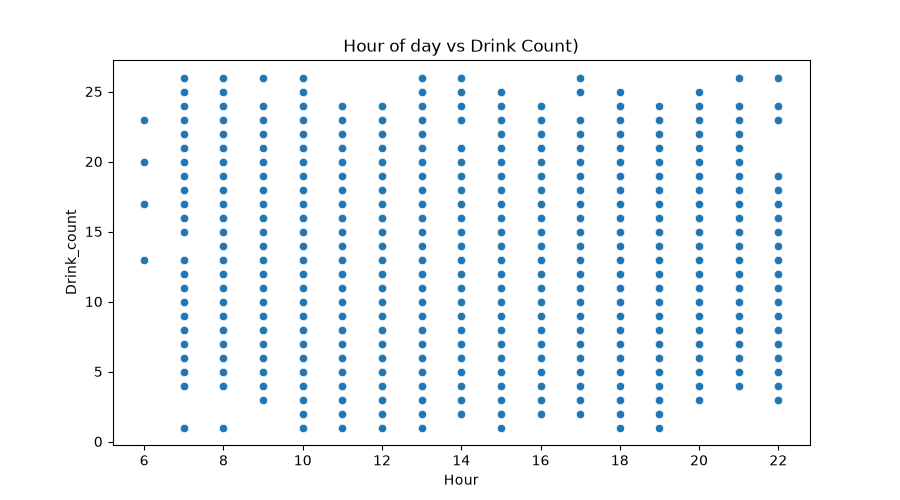

# ml-02-features

> Professional Python project: engineering and selecting features for machine learning.

## Project Description

This project focuses on how to prepare data for machine learning
by engineering and selecting features.

We learn to:

- handle missing values and outliers
- encode categorical variables
- scale and transform numeric features
- select the features most likely to help a model

Good features matter a great deal. This project helps build that intuition.

## Example Notebook + Your Notebook

Keep the example notebook as it is.
Either copy it or use it to build a new notebook that ends in _yourname.
See [docs/your-files.md] for more.

Links:

- [ml_02_RucuAvinash.ipynb](notebooks/ml_02_RucuAvinash.ipynb)

## Working Files

You'll work with these areas:

- **data/raw** - raw data for exploration (only if you add a dataset)
- **docs/** - project narrative and documentation
- **src/mlstudio/** - the app is an example; run only (no need to modify)
- **notebooks/** - interactive analysis
- **pyproject.toml** - update authorship & links
- **zensical.toml** - update authorship & links

Technical Modification:
he original example used student‑related features to predict:

score

My modified project uses coffee‑sales transaction data to predict:

drink_count (the number of drinks sold per day)

To support this new target, I engineered two new features:
daily_revenue — total revenue per day

drink_count — number of drinks sold per day

These features were created using group‑by operations on the Date column and aggregating the money column.

This modification is important because the ml‑02‑features module focuses on feature engineering. Creating new features allowed me to apply the module skills to a realistic business problem: understanding café sales patterns and predicting drink volume.

This project uses supervised learning.

I know it is supervised because the dataset includes a known target value (drink_count) that the model learns to predict.

Type of ML Task
This is a regression task because:

drink_count is numeric

the model predicts a continuous quantity (daily drink volume)

I used:

LinearRegression

Linear Regression is appropriate because:

the target is numeric

the features are numeric

the model is simple, interpretable, and easy to debug

the coefficient chart clearly shows feature importance

Target Variable
drink_count

This target is more meaningful than predicting drink price (money) because drink count varies widely and correlates strongly with time‑based features.

Selected Features
hour_of_day
Weekdaysort
Monthsort
daily_revenue
Original Dataset Columns
The Coffee Sales dataset included:
transaction_id
payment_type
money
drink_type
time_of_day
weekday
month
Weekdaysort
Monthsort
Date
hour_of_day

I did not use categorical columns like drink_type directly because they would require encoding. Instead, I focused on numeric features that correlate strongly with drink volume.

Commands Used:
uv run python -m mlstudio. app_rucu

git add .
git commit -m "updated Technical modification, applied skills to new problem"
git push -u origin main

# Example Output
2026-07-10 00:04:30 | INFO | ML | Duplicate row count: 0
2026-07-10 00:04:30 | INFO | ML | Create clean view.........
2026-07-10 00:04:30 | INFO | ML | Creating clean modeling view
2026-07-10 00:04:30 | INFO | ML | Engineering new feature: daily revenue
2026-07-10 00:04:30 | INFO | ML | Clean view: 3547 rows, 5 columns
2026-07-10 00:04:30 | INFO | ML | Train supervised model....
2026-07-10 00:04:30 | INFO | ML | Training LinearRegression model
2026-07-10 00:04:30 | INFO | ML | Mean absolute error: 0.70
2026-07-10 00:04:30 | INFO | ML | R-squared: 0.97
2026-07-10 00:04:30 | INFO | ML | Predict one case..........
2026-07-10 00:04:30 | INFO | ML | Predicting one new case
2026-07-10 00:04:30 | INFO | ML | New case:
   hour_of_day  Weekdaysort  Monthsort  daily_revenue
0           10            7         12         2000.0
2026-07-10 00:04:30 | INFO | ML | Predicted drink count: 64
2026-07-10 00:04:30 | INFO | ML | Create charts.............
2026-07-10 00:04:30 | INFO | ML | Creating chart: hours of day vs money
2026-07-10 00:04:30 | INFO | ML | Creating chart: model coefficients
2026-07-10 00:04:30 | INFO | ML | Summarize workflow........

The project loaded:

3,547 rows

11 original columns

0 missing values

0 duplicate rows

After feature engineering, the clean modeling view had:

3,547 rows

11 columns

The model results were:
Mean absolute error of 0.70
R -squared: 0.78
Predicted drink count: 87

These results are realistic and useful for understanding café sales patterns.This result is useful because it shows the model captures meaningful patterns in drink volume

## Project Documentation

Additional project instructions, terms, and notes:

[docs/index.md](docs/index.md)

## Citation

[CITATION.cff](./CITATION.cff)

## License

[MIT](./LICENSE)
