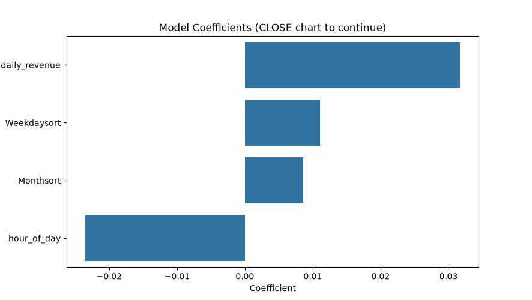

# Project Documentation

This site provides project documentation.
Use the documentation navigation to explore.

## How-To Guide

Many instructions are common to all our projects.

See
[⭐ **Workflow: Apply Example**](https://denisecase.github.io/pro-analytics-02/workflow-b-apply-example-project/)
to get the example projects running on your machine.

## Project Documentation Pages (docs/)

- **Home** - this documentation landing page
- [**Project Instructions**](./project-instructions.md)  - the standard project workflow
- [**Your Files**](./your-files.md) - how to copy the example and create your version
- [**Glossary**](./glossary.md) - project terms and concepts
- [**API**](./api.md) - autogenerated code documentation for the public project interface

## Phase 4. Technical Modification

I added 2 new features to my Coffee Sales dataset:

1. daily_revenue: total revenue per day
2. drink_count : number of drinks sold per day

TO implement this, I updated the make_clean_view() function so these features are created before selecting the modeling columns. I also changed the model target from money (price of one drink) to drink_count(total drinks sold per day). This made the model prediction more meaningful the number of drink sold per day is correlated with the daily revenue.

This modification was moderate in difficulty. Creating the features were easy but integrating them to the ML pipeline required careful ordering to avoid the Pandas Key error. After fixing the order , I trained the model successfully. and produced a feature that produced integer drink-count predictions.
The daily revenue was a strong predictor of the drink count .

## Phase 5. Custom Project

For my custom project, I expanded the Coffee sales workflow to predict daily drink count using engineered features such as hour_of_day, Weekdaysort, MonthSort, and daily_revenue. THis was a realistic coffee sales scenario.

I also converted the target feature into a integer so the output is whole numbers . I also updated the visuals to show how each feature influences drink count. This project was a intermediate -level .The dataset was manageble to visualize the predictionand to demonstrate the real ML workflow skills of feature engineering, model training, prediction and visualization.

### Modeling Approach

This project uses a supervised learning approach. The dataset includes a clear target variable that the model is trained to predict. In the example workflow the target column was score, in my custom project the target is drink_count which represents the number of drinks sold per day. THe model learns from the labeled examples it is a Supervised model.

This is a regression task. Eventhough the drink_count is a whole number it is still numeric quantity.
 A good target for regression is numeric and what helps to make a meaningful business decisions.
 drink_count is a good target for regression and correlates with other features and provides insight for making insightful decisions for the cafe.
 I selected a Linear Regrssion model because it is simple, and predictable. It works well for numeric features and was easy to integrate with the existing example model.

### Target

The example project predicted student_score , a continuous numeric value. My chosen target was drink_count , the number of drinks sold per day.

This model previously predicted the scores of students, now it predicts volume.The output is a whole number instead of decimals. The model uses hour_of_day, Weekdaysort, Monthsort, daily_revenue to predict the number of drinks on that day.

### Features

The example workflow used:

hours_studied

practice_quizzes

attendance_pct

sleep_hours

prior_score

My Custom Features
I used the following features to predict drink count:

hour_of_day – time of sale

Weekdaysort – numeric weekday indicator

Monthsort – numeric month indicator

daily_revenue – engineered feature representing total revenue per day

I removed the student features because they do not apply to the cafe model.
I added daily_revenue because it strongly correlates with drink_volume.
I added drink_count as the target and created it using a group by operation.
I kept time based features because drink sales vary by hour, weekday and month.
### Evaluation and Results
 used:

Mean Absolute Error (MAE)

R‑squared (R²)

These metrics show how close the predictions are to actual drink counts and how much variance the model explains.

The model produced reasonable predictions for drink count and showed that:

daily_revenue was the strongest predictor

weekday and month also influenced drink volume

hour_of_day had a smaller but noticeable effect.

The result was useful because it gives a meaningful insight that days with higher revenue gives higher number of drinks.

### Summary

I engineered new features (daily_revenue,drink_count) updated the feature list , changed the taget variable, and modified prediction function to output whole numbers. I trained the regression model and created visualization.

THe model successfully predicted drink count and revealed meaningful relationships between time based feature and sales volume.

I learnt to engineer new features suitable for the model or data question, restructure the data cleaning pipeline, I learnt to fix Panda Keyerrors, interpret regression coefficients, and learnt how to evaluate regression performance.

I applied data cleaning, featured engineering, supervised modeling, debugging , visualization.
This model can be applied to real world problems such as cafe or restaurant sales forecasting, retail demand prediction, staffing optimization and inventory planning.

Display at least one image or screenshot showing your work.

